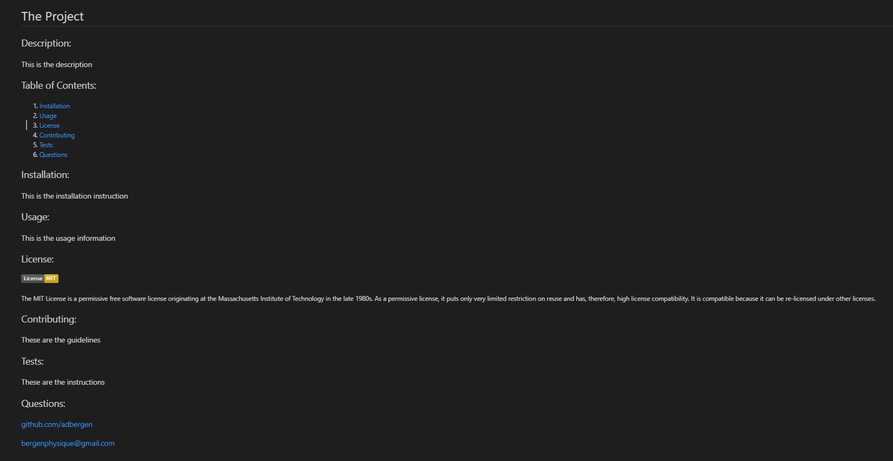

<h1 align="center">
README Generator
</h1>
<h4 align="center" style="margin-bottom:10px">Be sure to star my configuration repo so you can keep up to date on any daily progress!</h4>

  <h4>
    </a>
    
    
        
</h4>
 

This is a README generator application

  <h4>
    <a href="https://github.com/adbergen/README-generator">
      Github Repository
    </a>
 | 
<a href="https://adbergen.github.io/README-generator/">
      Github Pages
    </a>
     | 
<a href="https://drive.google.com/file/d/1GSQXny40JmoWirpDX4inkNKwIUCzE51e/view">
      Video Walkthrough
    </a>
  </h4>

## Table of Contents

- [Installation](#installation)
- [Usage](#usage)
- [Technologies](#technologies)
- [Contributing](#contributing)

## Installation

 
Using npm:

 
 

    npm install && node index

## Usage

- This application allows the user to generate a readme that includes answers relevant to the user's github project

## Technologies

<ul>
<li>HTML</li>
<li>CSS</li>
<li>Bootstrap</li>
<li>Javascript, JQuery, JSON</li>
<li>Node.js</li>
<li>GitHub</li>
</ul>

## Contributing

- Pull requests are welcome. For major changes, please open an issue first to discuss what you would like to change.

- Contributors: Anthony Bergen

